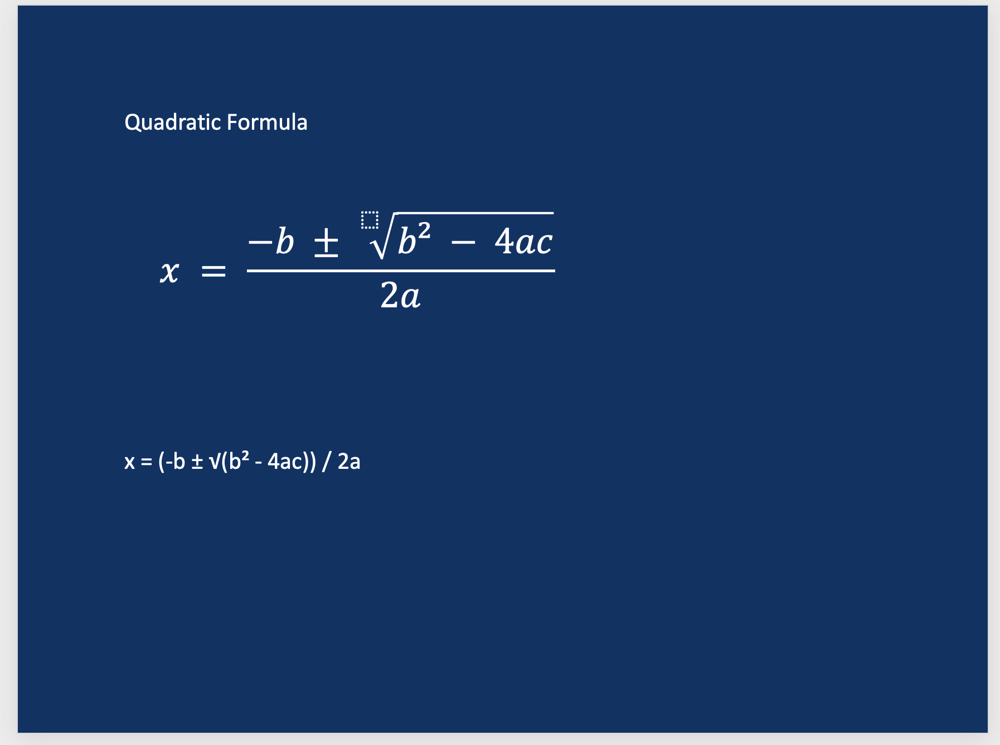

Examples
========

This directory contains working examples of python-pptx mathematical equation functionality.

Mathematical Equations
--------------------

The examples demonstrate various levels of mathematical equation complexity, from simple text to complex formulas with fractions and radicals.

Quadratic Formula Example
------------------------

**File**: ``examples/quadratic_equation_demo.py``

A complete working example that creates a PowerPoint slide with:

* Blue background slide
* White quadratic formula with proper mathematical structure
* Fraction with square root using OMML elements
* Proper PowerPoint-compatible XML structure

**Results:**

**Note:** This example uses a complete OMML XML-formatted string to create the equation.  It does
not "dynamically" build the equation from Python code.

**Usage**:

.. code-block:: bash

   python examples/quadratic_equation_demo.py

**Result**: Generates ``quadratic_equation_demo.pptx`` with a properly rendered quadratic equation.

Technical Details
---------------

The example demonstrates the complete XML structure required by PowerPoint:

.. code-block:: xml

   <mc:AlternateContent xmlns:mc="http://schemas.openxmlformats.org/markup-compatibility/2006">
     <mc:Choice xmlns:a14="http://schemas.microsoft.com/office/drawing/2010/main" Requires="a14">
       <p:sp>
         <p:txBody>
           <a:p>
             <a14:m>
               <m:oMathPara>
                 <m:oMath>
                   <!-- Mathematical content here -->
                 </m:oMath>
               </m:oMathPara>
             </a14:m>
           </a:p>
         </p:txBody>
       </p:sp>
     </mc:Choice>
     <mc:Fallback>
       <!-- Compatibility fallback -->
     </mc:Fallback>
   </mc:AlternateContent>
